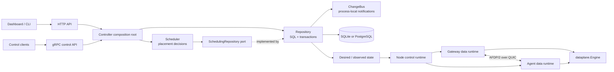
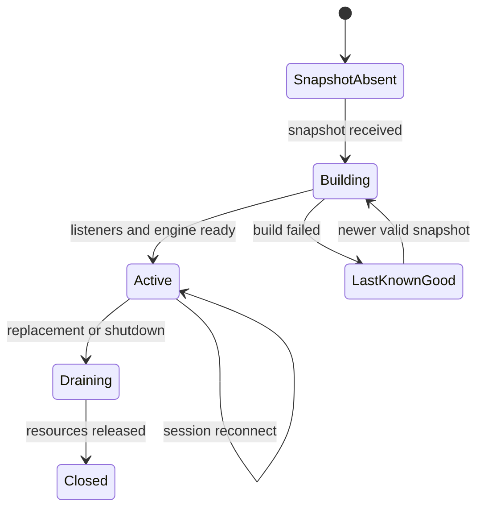

# AsterFerry architecture

This document describes the v2 architecture and the ownership rules that keep
the Controller, protocol, and data plane maintainable. It is written for
maintainers and release operators. It is intentionally about boundaries and
invariants rather than a catalogue of files.

## Scope and compatibility

AsterFerry is a self-hosted private-network forwarding system with one
authoritative Controller and multiple Nodes. A Node becomes a Gateway or Agent
after enrollment when the Controller publishes a typed Node Spec.

The current release line has these compatibility boundaries:

- REST and OpenAPI are the Controller API boundary.
- AFDP/2 over QUIC is the data-plane session boundary. The ALPN and version
  byte are part of the protocol identity; AFDP/1 and AFDP/2 are not fallback
  codecs.
- The normalized Controller database is a fresh v2 boundary. Its current
  database schema is v11.
- Snapshot and control-wire payloads are versioned typed documents. The
  database schema version, snapshot schema version, and protocol version are
  separate concepts and must not be used interchangeably.

Controller HA, shared VIP takeover, transparent connection migration, and a
distributed session store are outside the current product boundary. A Node
keeps its last valid local snapshot and reconnects after a control-plane or
data-plane interruption.

## Component boundaries



The dependency direction is deliberately one-way:

```text
domain
  ^
  |
afdp / controlwire / duplex / dataplane
  ^
  |
node                         controller
                                 |
                              Repository
```

`domain` contains shared typed values and validation. Protocol packages own
wire encoding and transport-facing behavior. `dataplane` owns admission,
quotas, routing, and egress policy. `node` owns local runtime generations and
data-plane resources. `controller` owns durable state, reconciliation,
placement, and control-plane serving. The data plane never imports the
Controller type.

## Controller composition and ownership

The Controller composition root creates one `Repository`, one `Scheduler`, and
the HTTP/gRPC servers. Their responsibilities are intentionally distinct:

| Component | Owns | Must not own |
| --- | --- | --- |
| `Repository` | SQL connections, schema, transactions, normalized resource persistence, snapshot materialization, observed state | placement policy or subscription locking details |
| `ChangeBus` | process-local action, snapshot, resource, and runtime subscriptions | database handles or durable state |
| `Scheduler` | candidate selection orchestration and scheduling metrics | SQL queries, transactions, or HTTP/gRPC concerns |
| `Schedule` | pure placement decision from an agent and candidate set | I/O, retries, or notification side effects |
| HTTP/gRPC servers | authentication, request validation, response mapping, transport lifecycle | direct placement decisions or ad-hoc SQL |

Repository writes commit before their corresponding ChangeBus notification is
published. Notification delivery is best effort and bounded; a missed
notification cannot make the database less authoritative because the next
reconciliation or explicit read reloads durable state.

`Scheduler` receives a named `SchedulingRepository` port. Candidate loading is
set-based and bounded by the database parameter limit; placement itself is a
pure function. Scheduling retries database port conflicts, while explicit
user-requested conflicts remain errors.

The Repository remains a concrete type by design. Its public surface is an
internal application boundary with transaction-aware methods, revision
semantics, idempotency, and SQLite/PostgreSQL dialect behavior. Replacing it
with a broad mock interface would hide those invariants and recreate the
God-object problem under a different name. Only consumers that need
substitution receive a narrow port.

## Control-plane lifecycle

1. `Init` creates the Controller configuration, trust material, and initial
   database.
2. Enrollment authenticates a one-time token and issues a node certificate.
3. Resource writes validate typed documents, update normalized rows and
   relationship rows in one transaction, then publish bounded notifications.
4. Scheduler materializes a node-scoped desired snapshot, assigns a generation,
   computes a checksum, and persists the snapshot.
5. Node control runtime fetches the snapshot and reports applied/observed state.
6. Reconciliation marks stale assignments degraded, releases placement
   occupancy, and schedules healthy replacements when policy permits.

Every optimistic write carries a revision or idempotency boundary where
applicable. One-time plaintext secrets are returned only on the first create;
an idempotent retry returns safe metadata and never reconstructs the secret.

## Node and data-plane lifecycle



A generation owns its listeners, sessions, UDP flows, telemetry registry, and
cancel context. A new generation is built privately and published only after
its policy and listeners are valid. Closing a generation is idempotent.

AFDP sessions carry authenticated assignment identity. A Gateway opens data
streams or UDP flow state for an Agent; the Agent applies `dataplane.Engine`
policy before dialing local targets. `duplex.CopyDuplex` preserves normal TCP
and QUIC half-close semantics: EOF closes only the destination write half;
non-EOF failures abort both directions.

UDP flow ownership has one cleanup path, `removeUDPFlow`. It removes both
indexes only when the pointer identity still matches, then closes runtime
telemetry, stream, and admission lease exactly once. This identity gate is
what prevents late cleanup from an old session or generation from deleting a
replacement flow.

Agent reconnect has explicit internal phases:

```text
disconnected -> dialing -> handshaking -> admitting -> serving
       ^             |          |             |          |
       |             +----------+-------------+----------+
       |                         failure -> backoff
       +---------------- cancellation / shutdown
```

Exponential backoff is retained for dial, handshake, and admission failures.
It resets when a session is admitted and enters serving. An old session cannot
clear a newer session for the same assignment.

## Storage model

Relational tables hold identity, revisions, timestamps, ownership, indexes,
and relationship constraints. Typed JSON is retained for complete snapshots,
opaque protocol documents, and fields whose unit is the document itself. A
relationship table is not an independent source of truth: document and
relationship updates occur in the same Repository transaction and are read
back into one typed domain value.

The Repository is the only owner of `*sql.DB`. SQL dialect differences are
isolated behind the database dialect helpers. HTTP handlers, gRPC handlers,
Scheduler, and ChangeBus never open connections or issue ad-hoc SQL.

## Interface policy

Interfaces are introduced at substitution or ownership boundaries, not as a
mechanical wrapper for every concrete type:

- `afdp.Conn` is the small protocol transport port used by session code and
  tests.
- Controller uses the named `grpcServer` lifecycle port and standard
  `net.Listener` instead of anonymous structural interfaces.
- `SchedulingRepository` is the narrow persistence port consumed by Scheduler;
  `Repository` implements it with a compile-time assertion.
- `duplex.WriteHalfCloser` and `duplex.Aborter` name optional transport
  capabilities shared with Node.
- Repository and ChangeBus stay concrete inside Controller because there is one
  implementation and their transaction/concurrency behavior is part of the
  invariant being tested.

When adding an interface, document which consumer owns it and what behavior it
guarantees. When adding an implementation, add a compile-time assertion at the
boundary and a contract test for the observable behavior.

## Testing strategy

The test suite has four distinct jobs:

- `*_contract_test.go` verifies stable behavior, API responses, errors,
  persistence semantics, and resource invariants.
- `*_state_machine_test.go` drives a deterministic reference model through
  valid and adversarial transitions and compares observable state after every
  command.
- `*_fuzz_test.go` checks that untrusted protocol input does not panic or
  violate decoder bounds. Fuzzing is not a substitute for a behavior oracle.
- `*_bench_test.go` measures protocol throughput and allocation regressions.

State-machine failures print their fixed seed and command trace. Real loopback
QUIC/UDP tests complement the model tests so transport behavior is tested at
both the pure lifecycle and actual protocol layers. New behavior should first
receive a contract test; a regression test is appropriate only when it adds a
specific historical failure case not already expressed by a contract.

## Availability and operational limits

The Controller is currently a single replica. Sessions and active runtime
registries are process-local, so a Controller or Node process restart requires
new sessions and may invalidate in-memory authentication sessions. Durable
resources, snapshots, audit history, and last-known-good Node cache are the
recovery anchors.

Metrics and readiness exposure are deployment policy: the standard metrics
listener is authenticated unless an operator explicitly exposes it behind a
trusted scrape boundary. OpenAPI documents are anonymous documentation
endpoints. Deployments must make that difference deliberate in their ingress
policy.

For release procedures, compatibility guarantees, supported platforms, and
soak requirements, see [`docs/release-runbook.md`](release-runbook.md),
[`docs/compatibility.md`](compatibility.md), and
[`docs/support-matrix.md`](support-matrix.md).
