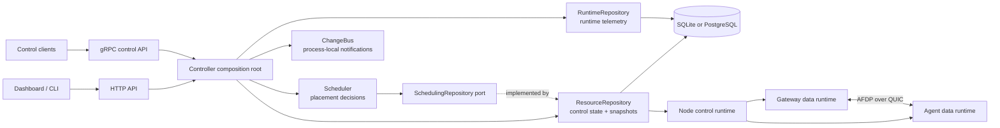

# AsterFerry architecture

This is the stable architecture contract for maintainers and release
operators. It describes ownership, dependency direction, and invariants. The
current implementation map and deliberately volatile protocol details live in
[`architecture-internals.md`](architecture-internals.md).

## Scope and compatibility

AsterFerry is a self-hosted private-network forwarding system with one
authoritative Controller and multiple Nodes. A Node becomes a Gateway or Agent
after enrollment when the Controller publishes a typed Node Spec.

The stable boundaries are:

- REST/OpenAPI is the Controller HTTP contract.
- AFDP over QUIC is the data-plane session contract; protocol identity is
  explicit and versions are not silently downgraded.
- Desired snapshots and observed state are typed, versioned documents.
- The normalized Controller database is a fresh-generation boundary. Its
  database schema version is separate from wire and snapshot versions.

Controller HA, shared VIP takeover, transparent connection migration, and a
distributed session store are outside the current product boundary. Nodes
retain their last valid local snapshot and reconnect after interruption.

## Component boundaries



The dependency direction is one-way:

```text
domain
  ^
  |
afdp / controlwire / duplex / dataplane
  ^
  |
node                         controller
                                 |
                     composition root + repositories
```

`domain` owns shared typed values and validation. Protocol packages own wire
encoding and transport-facing behavior. `dataplane` owns admission, quotas,
routing, and egress policy. `node` owns local generations and data-plane
resources. `controller` owns durable state, reconciliation, placement, and
control-plane serving. The data plane never imports the Controller type.

## Controller ownership

| Component | Owns | Must not own |
| --- | --- | --- |
| `ResourceRepository` | identity, auth, enrollment, normalized resources, snapshots, observed state, audit, control settings | placement policy, runtime history, subscription locking |
| `RuntimeRepository` | runtime connections, runtime events, traffic rollups, runtime retention | resource CRUD or desired-state decisions |
| `ChangeBus` | bounded process-local action, snapshot, resource, and runtime subscriptions | database handles or durable state |
| `Scheduler` | candidate orchestration and scheduling metrics | SQL, transactions, HTTP/gRPC concerns |
| `Schedule` | pure placement decisions from typed inputs | I/O, retries, or notification side effects |
| HTTP/gRPC servers | auth, request validation, response mapping, transport lifecycle | SQL and ad-hoc placement decisions |

The composition root creates both repositories with one database handle and one
ChangeBus. The handle owns the connection pool lifecycle; repository methods
own transactions. There is no business-operation façade that proxies one
repository through the other.

Writes commit before their corresponding notification is published.
Notifications are bounded and best effort: durable state remains authoritative
and periodic reconciliation repairs a missed hint.

`Scheduler` consumes the narrow `SchedulingRepository` port. Candidate loading
is set-based and bounded by database parameter limits; the placement function
is pure. Explicit user conflicts are returned as errors, while scheduler
reconciliation may retry transient placement conflicts.

## Control-plane invariants

1. Resource writes validate typed documents and update all rows belonging to an
   aggregate in one transaction.
2. Relationship rows are derived from the same typed input as their owning
   aggregate and are never an independent source of truth.
3. Optimistic revisions and idempotency keys protect retries and concurrent
   writes. One-time plaintext secrets are returned only on the first create.
4. Snapshot materialization assigns a monotonically increasing generation and
   persists a checksum with the typed document.
5. Observed state is accepted only for the authenticated node and is checked
   against the current desired generation before it influences reconciliation.
6. Runtime telemetry is retained and pruned independently from low-frequency
   control resources.

## Storage and schema policy

Relational tables hold identity, revisions, timestamps, ownership, indexes,
and relationship constraints. Typed JSON is retained only where the document
itself is the unit of storage, such as complete snapshots and opaque audit or
bootstrap payloads. Normalized aggregate child tables preserve ordered lists
with dense zero-based positions; loaders reject gaps, unknown kinds, and
cross-owner metadata mismatches.

SQLite and PostgreSQL share the logical schema. Dialect-specific SQL and
placeholder behavior stay behind database helpers. The database schema,
snapshot schema, control protocol version, and runtime metric catalog version
are independent version spaces and must be named explicitly.

Runtime core metrics are typed fields with a finite catalog. Adding a persisted
metric is a control-contract change: update the domain catalog, database
contract, API description, producer/consumer behavior, and tests together.
High-cardinality or experimental measurements belong in bounded Prometheus
instrumentation until they become an intentional persisted contract.

## Protocol and data-plane invariants

A node builds a new generation privately and publishes it only after policy and
listeners validate. A generation owns its listeners, sessions, UDP flows,
telemetry registry, and cancellation context. Closing a generation is
idempotent, and an old generation cannot clear a newer generation's state.

AFDP authenticates assignment identity before data-plane admission. TCP
half-close, UDP flow identity, reconnect ordering, and cleanup ownership are
part of the data-plane behavior contract; their current state-machine details
are maintained in [`architecture-internals.md`](architecture-internals.md).

## Interface policy

Interfaces are introduced at substitution or ownership boundaries, not as a
mechanical wrapper for every concrete type:

- `afdp.Conn` is the small transport port used by session code and tests.
- `SchedulingRepository` is the narrow persistence port consumed by Scheduler.
- named listener/server lifecycle ports isolate transport shutdown behavior.
- repository types remain concrete because transaction and concurrency behavior
  is an invariant covered by contract tests.

Every interface must state which consumer owns it and what behavior it
guarantees. Every implementation boundary gets a compile-time assertion and a
contract test for observable behavior.

## Testing and release expectations

The suite distinguishes behavior contracts, state-machine oracles, fuzz input
bounds, and benchmarks. A regression test is useful when it records a specific
historical failure; it is not a substitute for a happy-path contract.

Release gates cover formatting, unit/race tests, integration protocol tests,
static analysis, frontend checks, schema/OpenAPI consistency, dependency
audit, secret scanning, cross-platform smoke tests, and the container build.
The release runbook is [`release-runbook.md`](release-runbook.md).

## Availability and operations

The Controller is currently a single replica. API sessions and active runtime
registries are process-local: a Controller restart invalidates in-memory login
sessions and requires Nodes to reconnect. Durable resources, snapshots, audit
history, and each Node's last-known-good cache are the recovery anchors.

The management `/metrics` and `/readyz` routes use the normal authenticated
HTTP surface. The optional dedicated metrics listener is a separate deployment
surface and may be exposed only behind an explicitly trusted scrape boundary.
OpenAPI documents are anonymous documentation endpoints. This difference is a
deployment policy and must remain documented in operations guidance.

For compatibility promises and supported platforms, see
[`compatibility.md`](compatibility.md) and [`support-matrix.md`](support-matrix.md).
